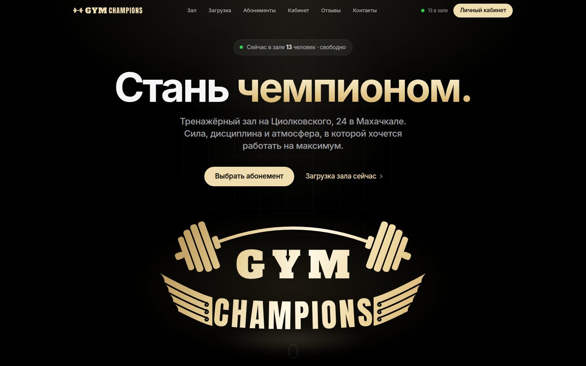
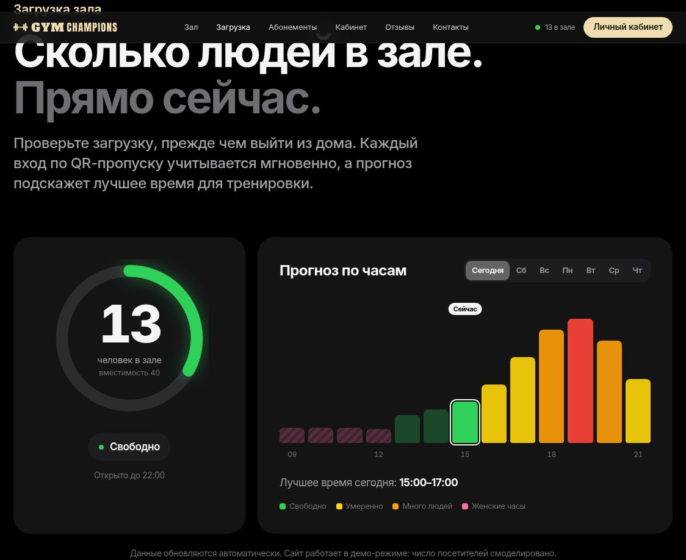
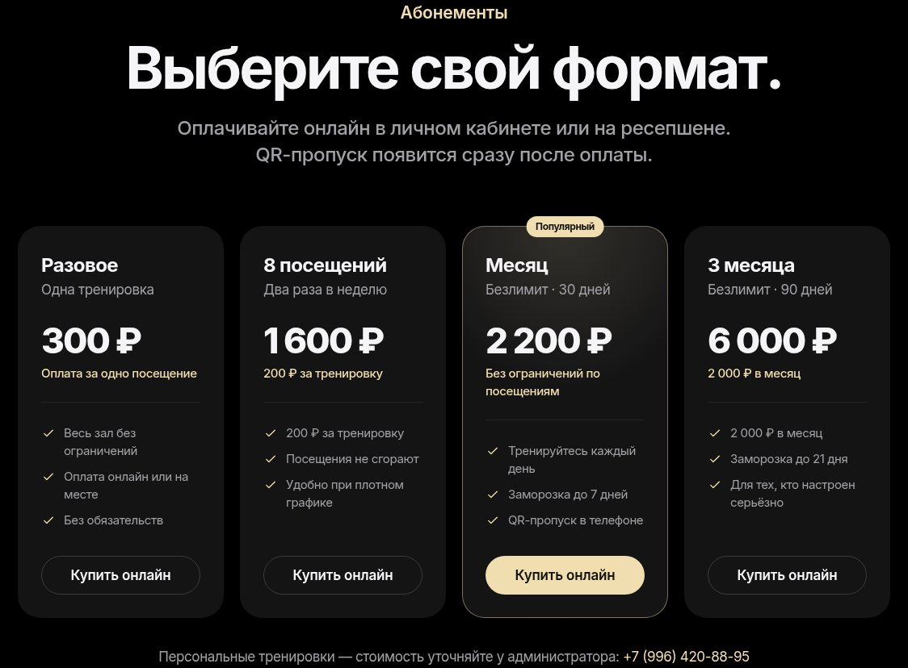
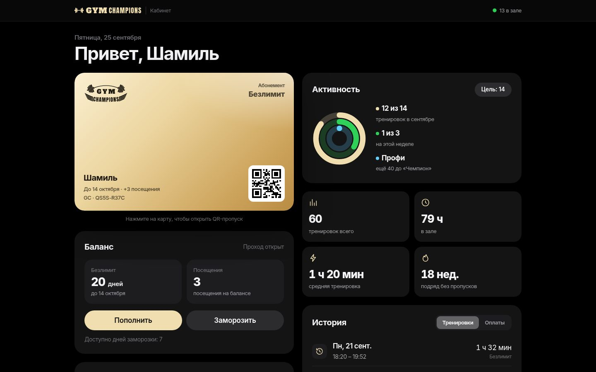
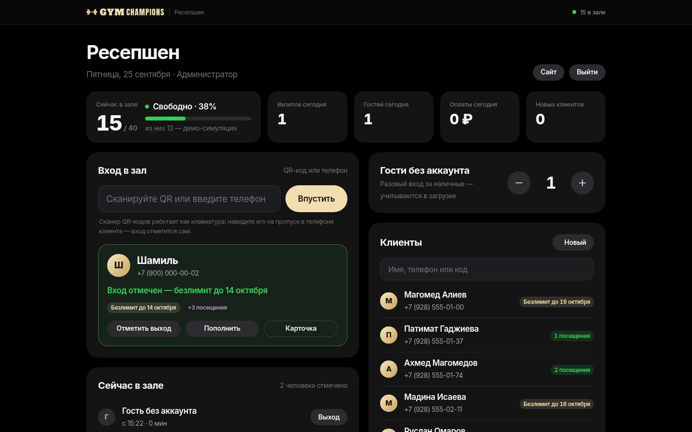
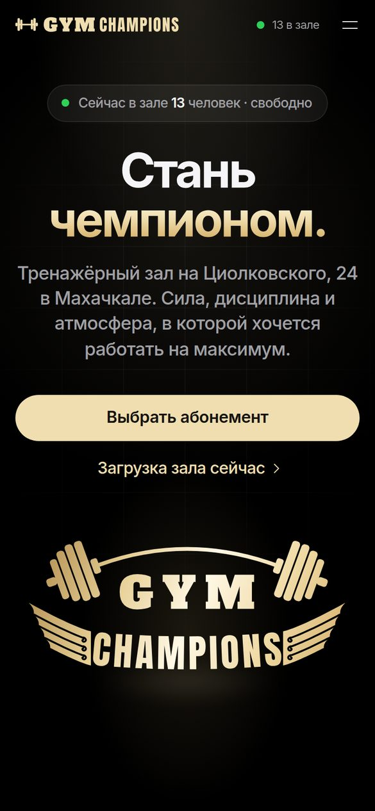
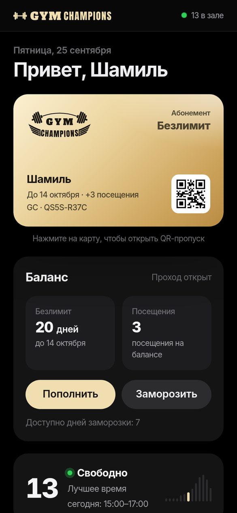

# Gym Champions — сайт тренажёрного зала

Сайт зала **Gym Champions** (Махачкала, ул. Циолковского, 24, 2 этаж) в стилистике Apple:
анимированная главная, загрузка зала в реальном времени, отзывы, личный кабинет с QR-пропуском
и онлайн-пополнением, панель ресепшена.




| Загрузка зала | Абонементы |
| --- | --- |
|  |  |

| Личный кабинет | Ресепшен |
| --- | --- |
|  |  |

| Главная на телефоне | Кабинет на телефоне |
| --- | --- |
|  |  |

## Что умеет

**Главная** (`/`)
- Интро при первом заходе: гриф прорисовывается, блины встают на место, буквы и крылья собирают эмблему,
  по ней проходит золотой блик, и она «приземляется» на первый экран. Показывается один раз за сессию,
  есть кнопка «Пропустить», учитывается настройка «уменьшить движение».
- Эффекты в духе apple.com: полупрозрачное меню, текст, подсвечивающийся при прокрутке, бенто-блоки,
  параллакс, макет iPhone с экраном кабинета.
- **Загрузка зала онлайн**: сколько людей в зале прямо сейчас (обновляется мгновенно, без перезагрузки),
  прогноз по часам на любой день недели и «лучшее время для тренировки».
- Абонементы, отзывы (виджет Яндекс Карт + карточки площадок), контакты, часы работы, карта.
- Серверный рендер для поисковиков, разметка schema.org (`ExerciseGym`), Open Graph.

**Личный кабинет** (`/account`)
- Регистрация и вход по номеру телефона.
- Карта-пропуск в стиле Wallet с QR-кодом, полноэкранный пропуск для входа.
- Баланс: пакет посещений и/или безлимит. Пополнение онлайн: выбор абонемента, оплата, анимация успеха.
- Заморозка безлимита (дни заморозки даёт абонемент) и досрочная разморозка с возвратом дней.
- Кольца активности, цель на месяц, уровни от «Новичка» до «Легенды», статистика, история тренировок и оплат.
- Кнопка «Я ушёл», смена имени и пароля, обновление QR-кода. Кабинет можно добавить на экран «Домой».

**Ресепшен** (`/admin`, только для администраторов)
- Отметка входа: QR-сканер (работает как клавиатура), камера (Chrome на Android) или номер телефона.
  Сразу видно, можно ли впустить: безлимит, остаток посещений, заморозка, «уже в зале».
- Кто сейчас в зале, отметка выхода, счётчик гостей без аккаунта (тоже учитываются в загрузке).
- Поиск клиентов, карточка клиента, новый клиент с временным паролем.
- Приём оплаты наличными или картой через терминал, показатели дня, вместимость зала.

## Быстрый старт (демо)

Нужен Node.js **22.13+** (используется встроенный SQLite, ничего компилировать не нужно).

```bash
npm install
npm run demo
```

Откройте http://localhost:3000. В демо-режиме создаются тестовые аккаунты, а загрузка зала
моделируется по типичной кривой (на странице это подписано):

| Роль | Телефон | Пароль |
| --- | --- | --- |
| Клиент | +7 900 000-00-02 | `champion` |
| Администратор | +7 900 000-00-01 | `admin2026` |

Оплата в демо-режиме ненастоящая: карта не запрашивается у банка, деньги не списываются.
Вне демо-режима демо-оплата отключена.

## Витрина на GitHub Pages

Сайт: **https://tgsaver.github.io/Champions/**

Workflow `.github/workflows/pages.yml` при каждом пуше в `main` собирает статическую версию
(`npm run build:static` → `dist/`) и кладёт её в ветку `gh-pages`, откуда её публикует GitHub Pages.
На Pages работает главная целиком (интро, загрузка зала смоделирована в браузере, абонементы, отзывы, контакты).
Личный кабинет и ресепшен требуют сервер с Node.js — на Pages вместо них страница-пояснение.

## Запуск для настоящего зала

1. Проверьте и поправьте данные зала в [`config/gym.js`](config/gym.js) (см. чек-лист ниже).
2. Задайте переменные окружения — пример в [`.env.example`](.env.example). Главное:
   `DEMO_MODE=false`, `ADMIN_PHONE` и `ADMIN_PASSWORD` для первого администратора, `PUBLIC_URL`.
3. Запустите:

```bash
npm ci --omit=dev
npm start
```

Или через Docker:

```bash
cp .env.example .env   # заполните
docker compose up -d --build
```

Ещё одного администратора можно добавить командой
`npm run create-admin -- +79001234567 "Имя Фамилия"` (пароль сгенерируется и выведется один раз;
если номер уже зарегистрирован, клиент получит права администратора).

### nginx и HTTPS

Загрузка зала приходит по Server-Sent Events, поэтому для `/api/occupancy/stream` отключите буферизацию:

```nginx
server {
    server_name example.ru;
    location / {
        proxy_pass http://127.0.0.1:3000;
        proxy_set_header Host $host;
        proxy_set_header X-Forwarded-For $proxy_add_x_forwarded_for;
        proxy_set_header X-Forwarded-Proto $scheme;
    }
    location /api/occupancy/stream {
        proxy_pass http://127.0.0.1:3000;
        proxy_set_header Host $host;
        proxy_buffering off;
        proxy_read_timeout 1h;
    }
}
```

Сертификат — например, `certbot --nginx`. За прокси включите `TRUST_PROXY=true` и `COOKIE_SECURE=true`.

### Резервные копии

Все данные — в одном файле SQLite (`data/gym.db`). Копию «на лету» делает `sqlite3 data/gym.db ".backup backup.db"`.

## Чек-лист перед запуском

Сайт собран по открытым данным из карточек зала. Проверьте:

- [ ] **Телефон** `+7 (996) 420-88-95` и **Instagram** `@champions_gym24` — взяты из поиска, не подтверждены.
- [ ] **Часы работы**: сейчас Пн/Ср/Пт 09:00–13:00 женские часы и 13:00–22:00 для всех, Вт/Чт/Сб 13:00–22:00,
      Вс — выходной. В разных справочниках часы отличаются.
- [ ] **Цены**: безлимит от 2 200 ₽ — из карточки зала; разовое, 8 посещений и 3 месяца — примеры.
- [ ] **Вместимость** зала (сейчас 40 человек) — меняется на ресепшене.
- [ ] **Логотип** перерисован в векторе по фото вывески (`public/assets/img/emblem.svg`). Если есть исходник
      от дизайнера — замените.
- [ ] **Фото зала**: сейчас на сайте только фото вывески. Хорошие фото зала сильно усилят главную.
- [ ] **Политика конфиденциальности** (`/privacy`) — шаблон: укажите оператора персональных данных
      (ИП/ООО, ИНН, адрес).
- [ ] **Карта**: адрес виджета — в `config/gym.js` (`maps.mapWidgetUrl`). Точный код можно взять в Яндекс Картах:
      карточка зала → «Поделиться» → «Встроить карту».

## Отзывы

- На главной встроен **официальный виджет отзывов Яндекс Карт** — он сам показывает актуальный рейтинг
  и свежие отзывы о зале (id организации `199573048114`).
- Карточки площадок (Яндекс Карты, 2ГИС) со ссылками «Читать» и «Оставить отзыв» и рейтингом —
  в [`content/reviews.json`](content/reviews.json).
- Туда же можно добавить избранные отзывы — они появятся лентой карточек над виджетом:

```json
{ "author": "Имя", "date": "2026-09-01", "rating": 5, "source": "2gis", "text": "Текст отзыва" }
```

## Как считается загрузка зала

- Каждый вход по QR-коду или по телефону на ресепшене открывает визит, выход его закрывает
  (на ресепшене или кнопкой «Я ушёл» в кабинете). Гостей без аккаунта ресепшен считает кнопками +/−.
- Если выход не отметили, визит закрывается сам через 150 минут (`occupancy.autoCheckoutMinutes`).
- Загрузка = люди в зале / вместимость: до 40% — «Свободно», до 70% — «Умеренно», до 90% — «Много людей».
- Прогноз по часам строится по истории посещений за последние 8 недель (нужно хотя бы 3 недели данных
  для дня недели), а до этого — по типичной кривой загрузки тренажёрного зала.
- Все страницы получают изменения мгновенно по Server-Sent Events (`/api/occupancy/stream`).

## Онлайн-оплата (ЮKassa)

В демо-режиме работает демо-оплата без списания денег. На боевом сайте без ключей ЮKassa онлайн-оплата
выключена: клиенты выбирают абонемент в кабинете и оплачивают на ресепшене, а администратор отмечает оплату
в панели. Для приёма платежей онлайн:

1. Подключите магазин в [ЮKassa](https://yookassa.ru), получите `shopId` и секретный ключ.
2. Задайте `YOOKASSA_SHOP_ID`, `YOOKASSA_SECRET_KEY` и `PUBLIC_URL`.
3. В личном кабинете ЮKassa укажите адрес уведомлений `https://ваш-сайт/api/payments/webhook/yookassa`
   и события `payment.succeeded`, `payment.canceled`.
4. Если подключены «Чеки от ЮKassa» (54-ФЗ), включите `YOOKASSA_RECEIPTS=true` и укажите `YOOKASSA_VAT_CODE`.

Клиент уходит на страницу оплаты ЮKassa и возвращается в кабинет. Абонемент начисляется только после того,
как сервер сам запросил статус платежа у API ЮKassa: телу уведомления не доверяем, повторные уведомления
не начисляют абонемент второй раз. Данные карт на сервер зала не попадают. Интеграция покрыта тестами
на имитации API, но с живым магазином её нужно проверить тестовым платежом.

## Разработка

```bash
npm run dev    # перезапуск при изменениях
npm test       # тесты (node:test): логика абонементов, загрузка, API, ЮKassa
```

```
config/gym.js          данные зала: контакты, расписание, абонементы, вместимость
content/reviews.json   отзывы и карточки площадок
server/                Express 5 + node:sqlite
  app.js               приложение, заголовки безопасности, CSRF-защита
  memberships.js       абонементы, вход/выход, заморозка, статистика
  occupancy.js         загрузка, прогноз, live-обновления
  payments.js          демо-оплата, оплата на ресепшене; yookassa.js — клиент ЮKassa
  routes/              API: auth, me, payments, admin, public
  views/               шаблоны страниц (EJS)
public/assets/         стили, скрипты, шрифт Inter, логотип
scripts/create-admin.js
test/
```

**Безопасность:** пароли — scrypt; сессии — случайный токен в httpOnly-cookie (в базе хранится только хэш);
изменяющие запросы принимаются только в JSON и только с того же сайта (защита от CSRF); ограничение
попыток входа; Content-Security-Policy; права администратора проверяются на сервере.
Подтверждения номера по SMS пока нет — при необходимости подключается SMS-шлюз.

Шрифт Inter распространяется по лицензии SIL Open Font License (`public/assets/fonts/LICENSE-Inter.txt`).
